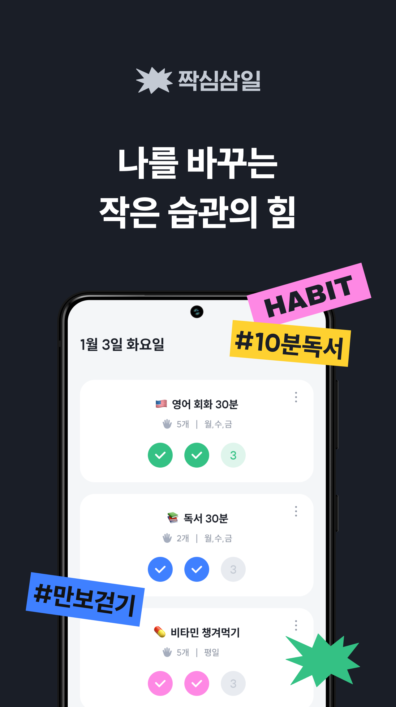
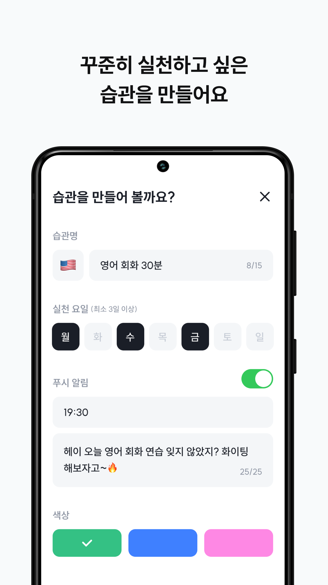
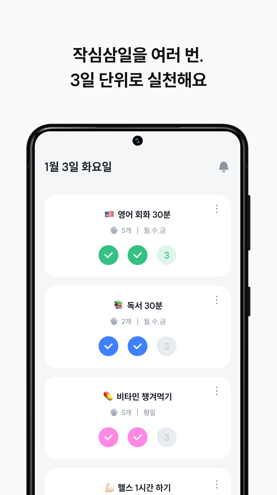
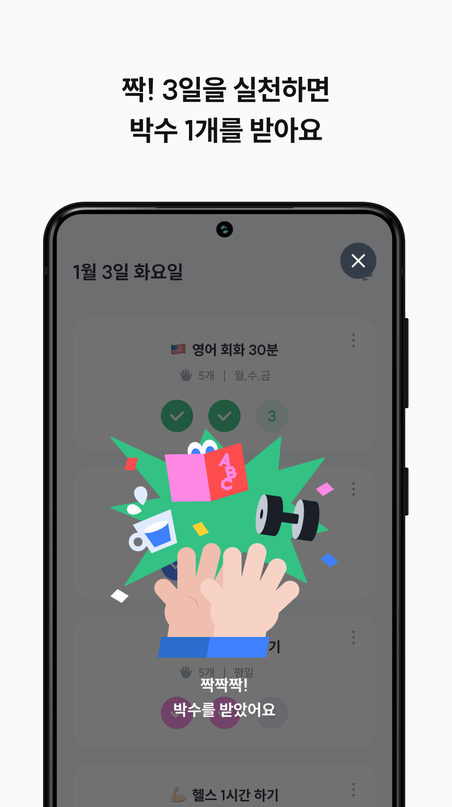
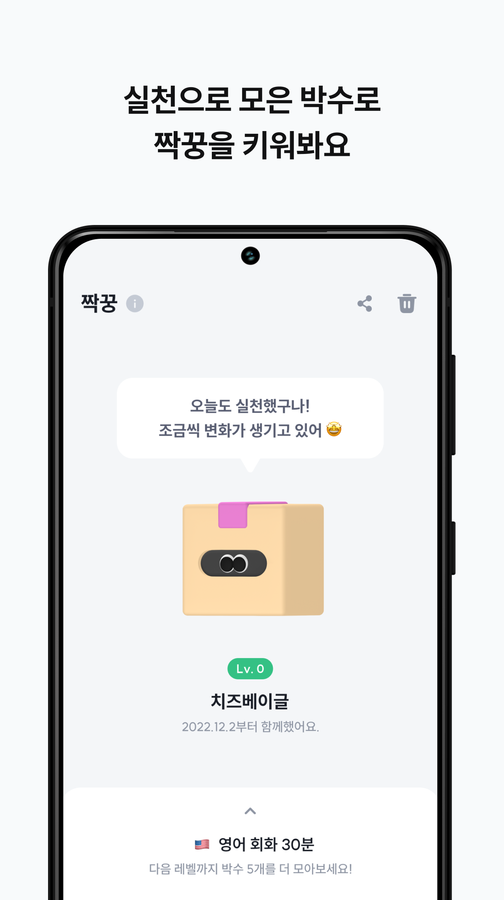
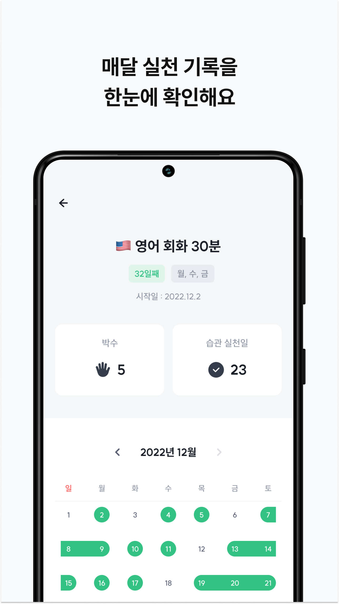
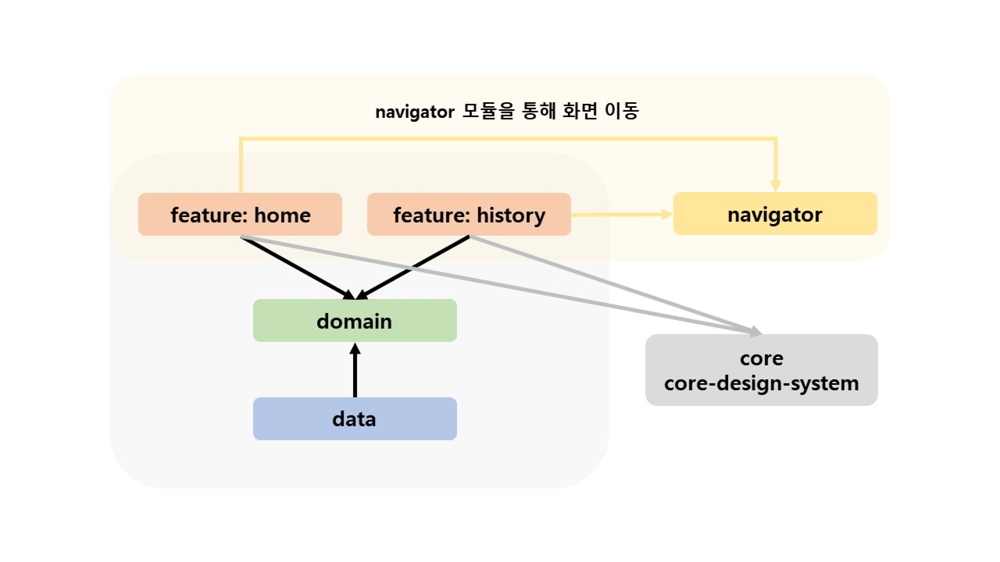
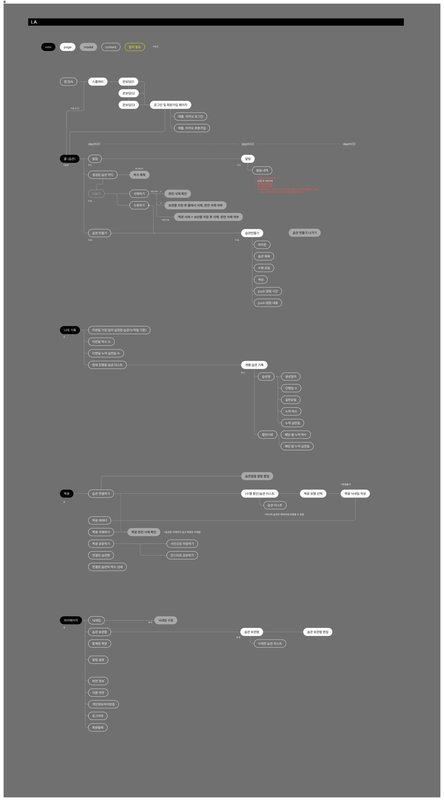

# 짝심삼일

 

> 작심삼일러를 위한 습관형성 앱

나를 바꾸는 작은 습관, 지금 시작해보세요! [짝심삼일 (Google Play)](https://play.google.com/store/apps/details?id=com.depromeet.threedays)

## 📱 Screenshots

| | | | | | |
|-|-|-|-|-|-|
|  |  |  |  |  |  |

## 🏢 Architecture

'짝심삼일' 앱의 아키텍처입니다. 
크게 안드로이드에서 권장하는 data, domain, presentation 모듈로 나누었습니다(https://developer.android.com/topic/architecture). 
또한 공통 로직과 디자인을 포함하는 Core 모듈을 만들고 presentation 계층을 기능별로 분리하여 유지보수성을 높였습니다.

## 🗺️ Information Architecture

## ⚙️ Prerequisites
'짝심삼일' 앱을 개발하기 위해 필요한 도구입니다.

- Android Studio Dolphin 🐬(2021.3.1)
    - https://developer.android.com/studio
    - https://android-developers.googleblog.com/2022/09/android-studio-dolphin.html
- Android SDK 33
    - https://developer.android.com/about/versions/13/setup-sdk
- Java 11
    - https://adoptium.net/temurin/releases/?version=11
- local.properties 내용 추가
    - https://github.com/depromeet12th/three-days-android-credentials
- 카카오 해시 키 등록
    - https://github.com/depromeet12th/three-days-android-credentials#kakao-developer-android-app

## 🛠️ Infrastructure
### Continuous Integration
Pull Request 가 생성되면 GitHub Actions 을 통해 다음 작업들을 자동으로 진행합니다.
- Pull Request author 를 assinee 지정
- debug 앱으로 빌드가 잘 되는지 확인
- sonarlint 앱을 사용해 정적분석을 하고, 결과를 코멘트로 추가

### Continuous Delivery
#### Debug
develop 브랜치로 머지되면 GitHub Actions 을 통해 다음 작업들을 자동으로 진행합니다.
1. alpha buildType 으로 빌드해서 apk 파일을 생성
2. 1에서 생성한 파일을 Firebase App Distribution 으로 배포

#### Release
새 버전을 플레이스토어에 배포하는 경우, 다음 작업들을 수동으로 진행합니다.  
(release keystore 필요, https://github.com/depromeet12th/three-days-android-credentials)

1. release/{버전이름} 형태로 브랜치를 생성
2. 버전 코드 및 이름을 변경
3. release buildType 으로 빌드해서 .aab 파일을 생성
4. 3에서 생성한 파일을 Google Play Console 에 업로드하고 앱 버전 변경 검토를 요청
    1. 리젝되면 이슈를 해결하고, 버전을 변경
    2. 3번부터 다시 진행
5. 앱 버전 변경이 승인되면,
    1. release 브랜치를 develop, main 브랜치에 각각 머지하고 (`git merge release/.. --no-ff`)
    2. 버전이름으로 태그를 생성
    3. 변경내역을 푸시 

## 📄 Contributing

See the [contributing docs](./CONTRIBUTING.md) for more information.

## 🙋 Contributors

|                                                                            |                                                                            |                                                                           |
|:--------------------------------------------------------------------------:|:--------------------------------------------------------------------------:|:-------------------------------------------------------------------------:|
|  |  |  |
|                  [김주환](https://github.com/juhwankim-dev)                   |                    [김혜인](https://github.com/kimhyeing)                     |                   [전해성](https://github.com/junhaesung)                    |

## 🔑 License
This project is licensed under the terms of the [MIT license](./LICENSE).
